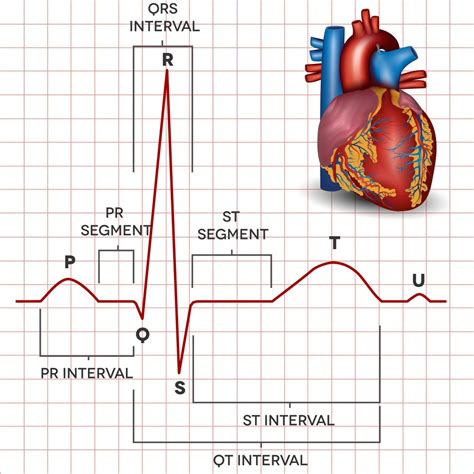

# README – ECG Viewer Annotation Tool

## English version

### Introduction
This project is an **ECG Viewer and Annotation Tool** built with **PySide6** and **PyQtGraph**.
The tool was developed as part of the **HeartGuard / LungInsight project**, which focuses on smart monitoring of heart and lung signals. With this app, you can load ECG data, visualize it, zoom in, select intervals, and export labels to **CSV** for further use in machine learning or research.


### What is an ECG signal?
An **electrocardiogram (ECG)** records the electrical activity of the heart over time.
Key components:

- **P-wave**: depolarization of the atria
- **QRS complex**: depolarization of the ventricles
- **T-wave**: repolarization of the ventricles



### ECG leads
The tool supports the 6 classic **limb leads**:

- Lead I, II, III
- aVR, aVL, aVF

Additionally, an **extended V1** signal is computed as the average of all leads.

### Features
- Load ECG data from **.txt files**
- Automatic calculation of 6 leads and V1
- Interactive plotting with zoom and pan
- Selection of time intervals (0.01s resolution)
- Add labels to intervals, per lead or V1
- Export annotations to **CSV**
- Live readout of the selected interval

### Requirements
- Python 3.10+
- PySide6
- pyqtgraph
- numpy
- pandas

### Installation:
```bash
pip install PySide6 pyqtgraph numpy pandas
```

### Usage
Run the application:
```bash
python ecg_viewer_pyqt.py
```

1. Click Open .txt to load an ECG file
2. Use the mouse and scroll to zoom in and out
3. Select an interval in V1 or an individual lead
4. Choose a label and a target lead → click Add
5. Export results via Export CSV

## Code description
### Key components
- **load_ecg_txt:** loads and parses ECG files, computes leads
- **LabelStore:** manages labels and exports to DataFrame/CSV
- **App (Qt MainWindow):** main application with plots, controls, and event-handlers

### Signal processing
- Parsing timestamps and estimating sampling rate
- Deriving leads III, aVR, aVL, and aVF from Lead I & II
- Extended V1: average of all leads

### User Interface (UI)
- 6-lead grid + V1-avg plot
- Cursor and interactive interval selection
- Right panel with buttons, labels, and export

### Main functions
- `open_txt():` load and render data
- `on_move():` move cursor and show values
- `_on_any_region_changed():` synchronize intervals across all leads
- `add_label():` add labels to the list and visualization
- `export_csv():` export all intervals

## Credits

The original **Tkinter app** (included in the `experiments` folder of this repository) is derived from the following project:
[https://github.com/rediet-getnet/ECG-Signal-Viewer-and-Annotation-Tool](https://github.com/rediet-getnet/ECG-Signal-Viewer-and-Annotation-Tool)

Full credit goes to the original author for building this version.
After experimenting with the Tkinter implementation, we decided to continue with a **PySide6 + PyQtGraph** application because of its improved speed and usability. After that we modified the app to our specific needs for the **HeartGuard** project.
